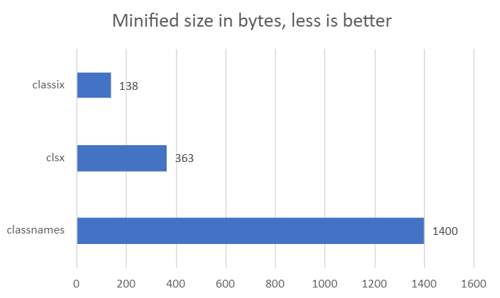

# classix


The [fastest](#comparison) and [tiniest](#comparison) utility for conditionally joining classNames.

## Installation

```bash
npm install classix
```

## Usage

Use any amount of string expressions and classix will join them like so:

```js
import cx from "classix";
// or
import { cx } from "classix";

cx("class1", "class2");
// => "class1 class2"

cx("class1 class2", "class3", "class4 class5");
// => "class1 class2 class3 class4 class5"

cx("class1", true && "class2");
// => "class1 class2"

cx(false && "class1", "class2");
// => "class2"

cx(true ? "class1" : "class2");
// => "class1"

cx("class1", false ? "class2" : "class3");
// => "class1 class3"

cx(...["class1", "class2", "class3"]);
// => class1 class2 class3

cx(
  "flex",
  isPrimary ? "bg-primary-100" : "bg-secondary-100",
  isLarge ? "m-4 p-4" : "m-2 p-2"
);
// => "flex bg-primary-100 m-2 p-2" *assuming isPrimary is true and isLarge is false
```

## Why?

classix considers string expressions faster to type and easier to reason about (conditions first, followed by classNames) than the alternative:

```js
// 🚫
clsx({ "class-1": isPrimary });
// ✅
cx(isPrimary && "class-1");

// 🚫
clsx({ "class-1": isPrimary && isLarge, "class-2": !isPrimary || !isLarge });
// ✅
cx(isPrimary && isLarge ? "class-1" : "class-2");
```

This reasoning enables classix to simplify its API by allowing only string expressions as arguments. Not only does it provide a consistent way of joining classNames, but using classix also leads to [better performance](#comparison) and a [smaller bundle size](#comparison) for your application.

## Comparison



Sources: [classix](https://bundlejs.com/api?q=classix), [clsx](https://bundlejs.com/api?q=clsx), [classnames](https://bundlejs.com/api?q=classnames)


Sources: Ran [benchmark](benchmark/) on an AMD Ryzen 5 5600x.

## Highlights

- Supports all major browsers
- Supports all versions of Node.js
- Works with both ES Modules and CommonJS
- Zero dependencies
- Fully typed with TypeScript
- Fully tested
- [Semver](https://semver.org/) compliant

## Migrating to classix

If you are using `classnames` or `clsx`, you can migrate to `classix` by changing your `imports`:

```diff
- import classnames from 'classnames';
+ import cx from 'classix';
```

And if you were using object arguments, you'll have to convert them to string arguments:

```diff
- classnames({ 'class-1': cond });
+ cx(cond && 'class-1')
```

That's it!

## Changelog

For a list of changes and releases, see the [changelog](https://github.com/alexnault/classix/releases).

## Contributing

Found a bug, have a question or looking to improve classix? Open an [issue](https://github.com/alexnault/classix/issues/new), start a [discussion](https://github.com/alexnault/classix/discussions/new) or submit a [PR](https://github.com/alexnault/classix/fork)!
