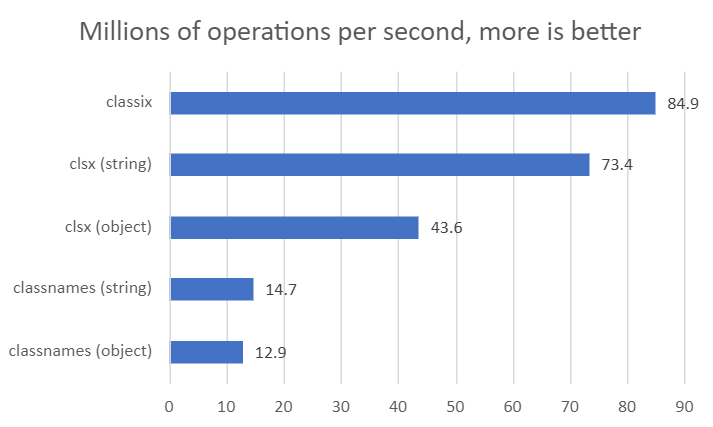

# classix


The [fastest](#comparison) and [tiniest](#comparison) utility for conditionally joining classNames.

## Installation

```bash
npm install classix
```

## Usage

Use any amount of string expressions and classix will join them like so:

```js
import cx from "classix";
// or
import { cx } from "classix";

cx("class1", "class2");
// => "class1 class2"

cx("class1 class2", "class3", "class4 class5");
// => "class1 class2 class3 class4 class5"

cx("class1", true && "class2");
// => "class1 class2"

cx(false && "class1", "class2");
// => "class2"

cx(true ? "class1" : "class2");
// => "class1"

cx("class1", false ? "class2" : "class3");
// => "class1 class3"

cx(...["class1", "class2", "class3"]);
// => class1 class2 class3

cx(
  "flex",
  isPrimary ? "bg-primary-100" : "bg-secondary-100",
  isLarge ? "m-4 p-4" : "m-2 py-2"
);
// => "flex bg-primary-100 m-2 p-2" *assuming isPrimary is true and isLarge is false
```

## Comparison


Sources: [classix](https://bundlephobia.com/package/classix), [clsx](https://bundlephobia.com/package/clsx), [classnames](https://bundlephobia.com/package/classnames)



Sources: Ran [benchmark](benchmark/) on an AMD Ryzen 5 5600x.

Compared to other libraries, classix simplifies its API by omitting the use of object arguments, which it considers less ergonomic than string expressions:

```js
// 🚫
cx({ "class-1": isPrimary && isLarge, "class-2": !isPrimary || !isLarge });
// ✅
cx(isPrimary && isLarge ? "class-1" : "class-2");
```

## Highlights

- Fastest & tiniest
- Zero dependencies
- Fully typed (with TypeScript)
- Fully tested
- Follows [semantic versioning](https://semver.org/)

## Changelog

For a list of changes and releases, see the [changelog](https://github.com/alexnault/classix/releases).

## Contributing

Found a bug, have a question or looking to improve classix? Open an [issue](https://github.com/alexnault/classix/issues/new), start a [discussion](https://github.com/alexnault/classix/discussions/new) or submit a [PR](https://github.com/alexnault/classix/fork)!
